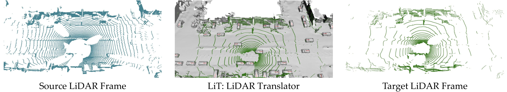

# LiT: LiDAR Translator

<p align="center">
  <a href="https://yxlao.github.io/lit"><strong>Project Page</strong></a> | <a href="https://github.com/yxlao/lit"><strong>Source Code</strong></a> | <a href="https://yxlao.github.io/lit/lit_paper.pdf"><strong>Paper</strong></a>
</p>

LiT (LiDAR Translator), is a pioneering framework aimed at bridging the domain gaps in LiDAR data from various devices and environments. It facilitates the unification of diverse LiDAR datasets, enhancing scalability and coherence in perception models. Our system includes advanced scene modeling, realistic LiDAR simulation, and a GPU-accelerated ray casting engine, enabling cutting-edge zero-shot domain detection. Explore LiT and see our interactive demos at our [project page](https://yxlao.github.io/lit), and check out our [paper](https://yxlao.github.io/lit/lit_paper.pdf) for more details.

<p align="center">
  
</p>


## Code Structure

```bash
# To get an overview of LiT, we recommend starting from the containers:
lit
├── containers                # Container classes for LiT
│   ├── base_container.py     # Base abstract container class
│   ├── fg_box.py             # Containing one foreground bounding box
│   ├── fg_object.py          # Containing one foreground object with multiple bounding boxes
│   ├── fg_scene.py           # Containing multiple foreground objects
│   ├── frame.py              # Containing one frame of the original data
│   ├── scene.py              # Containing multiple frames of the original data
│   ├── sim_frame.py          # Containing one frame of the simulated data
│   └── sim_scene.py          # Containing multiple frames of the simulated data

# The followings are the other modules of LiT:
├── ext                       # Compiled extensions
│   ├── __init__.py
│   └── lit_ext
├── extern                    # External modules
│   ├── deepsdf
│   ├── otk-pyoptix
│   └── spconv
├── bg_reconstructor.py       # Background reconstructor
├── fg_reconstructor.py       # Foreground reconstructor
├── __init__.py
├── lidar.py                  # LiDAR parameters
├── lidar_utils.py            # LiDAR utilities
├── path_utils.py             # Defines the data paths for LiT (important)
├── raycast_engine_cpu.py     # ─┐
├── raycast_engine_gpu.cu     #  │
├── raycast_engine_gpu.py     #  ├─> LiT's GPU OptiX raycast engine
├── raycast_engine.py         #  │
├── vector_math.h             # ─┘
├── recon_utils.py            # Reconstruction utilities
└── utils.py                  # General utilities

# The followings are the "driver code", you run these scripts to use LiT:
lit_tools
├── global_configs.py
├── lit_01_extract_scene.py   # Extract scenes to LiT's format
├── lit_02_recon_bg.py        # Reconstruct background
├── lit_03_recon_fg.py        # Reconstruct foreground
├── lit_04_sim.py             # Run simulations
├── lit_raykeep_dataset.py    # ─┐
├── lit_train_mlp.py          #  ├─> Ray drop related
└── lit_train_raykeep.py      # ─┘
```

## Installation

```bash
# conda env
conda create -n lit python=3.10
conda activate lit

# torch
pip install torch==2.0.0 torchvision==0.15.1 torchaudio==2.0.1 --index-url https://download.pytorch.org/whl/cu118

# additional dependencies from pip
pip install waymo-open-dataset-tf-2-11-0==1.6.0
pip install nuscenes-devkit==1.0.5

# nksr (python-pycg[full] includes open3d)
pip install nksr -f https://nksr.huangjh.tech/whl/torch-2.0.0+cu118.html
pip install torch-scatter -f https://data.pyg.org/whl/torch-2.0.0+cu118.html
pip install python-pycg[full] -f https://pycg.s3.ap-northeast-1.amazonaws.com/packages/index.html
python -c "import nksr"

# extern: spconv
cd lit/extern/spconv
rm -rf build
python setup.py bdist_wheel
pip install dist/spconv-1.2.1-cp310-cp310-linux_x86_64.whl
cd ../../..

# extern: otk-pyoptix
cd lit/extern/otk-pyoptix
pip install cupy-cuda11x numpy pillow pynvrtc pytest
rm -rf optix/build
PYOPTIX_CMAKE_ARGS="-DOptiX_INSTALL_DIR=${PWD}/sdk/NVIDIA-OptiX-SDK-7.4.0-linux64-x86_64" pip install -e optix
cd ../../..

# lit
pip install -r requirements.txt
pip install -e .

# fixes, as waymo-open-dataset has unnecessarily strict version requirements
pip install numpy==1.22 protobuf==3.20.0
```

## Dataset


### KITTI Dataset

Please download the official [KITTI 3D object detection](http://www.cvlibs.net/datasets/kitti/eval_object.php?obj_benchmark=3d) dataset and organize the downloaded files as follows.

```bash
data/kitti
│── training
│   └── calib & velodyne & label_2 & image_2
└── testing
    └── calib & velodyne & image_2
```

Then, run the pre-processing scripts

```bash
python -m pcdet.datasets.kitti.kitti_dataset create_kitti_infos \
    tools/cfgs/dataset_configs/kitti_dataset.yaml
```

After pre-processing, the directory layout should look like this:

```bash
tree -lL 1 data/kitti

data/kitti
├── gt_database
├── kitti_dbinfos_train.pkl
├── kitti_infos_test.pkl
├── kitti_infos_train.pkl
├── kitti_infos_trainval.pkl
├── kitti_infos_val.pkl
├── testing
└── training
```

### nuScenes Dataset

Please download the official [NuScenes 3D object detection dataset](https://www.nuscenes.org/download) and
organize the downloaded files as follows.

```bash
data/nuscenes
└── v1.0-trainval
    │── samples
    │── sweeps
    │── maps
    └── v1.0-trainval
```

Then, run the pre-processing scripts

```bash
python -m pcdet.datasets.nuscenes.nuscenes_dataset --func create_nuscenes_infos \
    --cfg_file tools/cfgs/dataset_configs/nuscenes_dataset.yaml \
    --version v1.0-trainval
```

After pre-processing, the directory layout should look like this:

```bash
tree -lL 2 data/nuscenes

data/nuscenes
└── v1.0-trainval
    ├── gt_database_10sweeps_withvelo
    ├── maps
    ├── nuscenes_dbinfos_10sweeps_withvelo.pkl
    ├── nuscenes_infos_10sweeps_train.pkl
    ├── nuscenes_infos_10sweeps_val.pkl
    ├── samples
    ├── sweeps
    ├── v1.0-test
    └── v1.0-trainval
```

### Waymo Dataset

Please download the official [Waymo Open Dataset](https://waymo.com/open/download/), including the training data `training_0000.tar~training_0031.tar` and the validation data `validation_0000.tar~validation_0007.tar`. Unzip all the above `xxxx.tar` files to the directory of `data/waymo/raw_data` as follows (You could get 798 *train* tfrecord and 202 *val* tfrecord).

```bash
data/waymo
│── raw_data
│   │── segment-xxxxxxxx.tfrecord
│   │── ...
│── waymo_processed_data
│   │── segment-xxxxxxxx/
│   │── ...
│── pcdet_gt_database_train_sampled_xx/
└── pcdet_waymo_dbinfos_train_sampled_xx.pkl
···
```

Then, run the pre-processing scripts

```bash
python -m pcdet.datasets.waymo.waymo_dataset --func create_waymo_infos \
    --cfg_file tools/cfgs/dataset_configs/waymo_dataset.yaml --workers 10
```

After pre-processing, the directory layout should look like this:

```bash
tree -lL 1 data/waymo

data/waymo
├── pcdet_gt_database_train_sampled_10
├── pcdet_waymo_dbinfos_train_sampled_10.pkl
├── raw_data
├── waymo_infos_train_extra.pkl
├── waymo_infos_train.pkl
├── waymo_infos_val_extra.pkl
├── waymo_infos_val.pkl
├── waymo_processed_data
└── waymo_processed_data_extra
```

## LiT Usage

1. Extract scenes
    ```bash
    cd lit_tools
    python lit_01_extract_scene.py --cfg_file ../tools/cfgs/dataset_configs/waymo_dataset_extract.yaml --split train
    python lit_01_extract_scene.py --cfg_file ../tools/cfgs/dataset_configs/waymo_dataset_extract.yaml --split valid
    python lit_01_extract_scene.py --cfg_file ../tools/cfgs/dataset_configs/nuscenes_dataset_extract.yaml --split train
    python lit_01_extract_scene.py --cfg_file ../tools/cfgs/dataset_configs/nuscenes_dataset_extract.yaml --split valid
    ```

2. Reconstruct background
    ```bash
    cd lit_tools
    python lit_02_recon_bg.py --data_domain waymo --data_version v0 --skip_existing
    python lit_02_recon_bg.py --data_domain nuscenes --data_version v0 --skip_existing
    ```

3. Reconstruct foreground
    ```bash
    cd lit_tools
    python lit_03_recon_fg.py --data_domain waymo --data_version v0 --skip_existing
    python lit_03_recon_fg.py --data_domain nuscenes --data_version v0 --skip_existing
    ```

4. Run simulations
    ```bash
    cd lit_tools

    # Waymo -> KITTI
    python lit_04_sim.py --src_style waymo --dst_style kitti --skip_existing --data_version v0

    # Waymo -> nuScenes
    python lit_04_sim.py --src_style waymo --dst_style nuscenes --skip_existing --data_version v0

    # Waymo -> Waymo (self translation)
    python lit_04_sim.py --src_style waymo --dst_style waymo --skip_existing --data_version v0

    # nuScenes -> KITTI
    python lit_04_sim.py --src_style nuscenes --dst_style kitti --skip_existing --data_version v0

    # nuScenes -> nuScenes (self translation)
    python lit_04_sim.py --src_style nuscenes --dst_style nuscenes --skip_existing --data_version v0
    ```

## Training and Testing

The training and testing steps are largely the same as [ST3D](https://github.com/CVMI-Lab/ST3D/blob/master/docs/GETTING_STARTED.md#training--testing) which are based on [OpenPCDet](https://github.com/open-mmlab/OpenPCDet).

First, you'll need to train "source-only" models which are purely trained on the source domain data. You shall follow the instructions in the [ST3D documentation](https://github.com/CVMI-Lab/ST3D/blob/master/docs/GETTING_STARTED.md#training--testing).

Then, you can train domain unification models. All you'll need to do is point to the correct configuration file and the correct checkpoint file. We give a few examples:

```bash
cd tools

# Waymo -> KITTI, PV-RCNN
python train.py --cfg_file cfgs/da-waymo-kitti_models/pvrcnn/pvrcnn_old_anchor_ft_v1.yaml --pretrained_model source_only/waymo_kitti_pvrcnn.pth --batch_size 16 --lr 0.01 --epochs 10

# nuScenes -> KITTI, SECOND-IoU
python train.py --cfg_file cfgs/da-nuscenes-kitti_models/secondiou/secondiou_old_anchor_ft_v1.yaml --pretrained_model ours_source_only/nuscenes_kitti_second.pth --batch_size 32 --lr 0.003 --epochs 10
```

Notes:
* After each epoch of training the domain unification model, the model will be automatically evaluated on the target test set.
* Typically, it takes less than 10 epochs to reach the best performance, you may pick the model with the best performance on the target test set.
